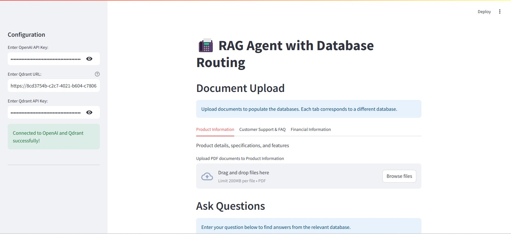
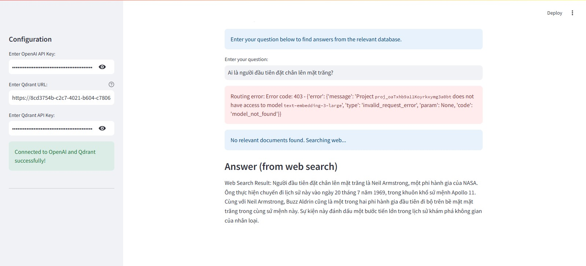

# 📠 RAG Agent with Database Routing

A Streamlit application that demonstrates an advanced implementation of RAG Agent with intelligent query routing. The system combines multiple specialized databases with smart fallback mechanisms to ensure reliable and accurate responses to user queries.

## Demo



## Features

- **Document Upload**: Users can upload multiple PDF documents related to a particular company. These documents are processed and stored in one of the three databases: Product Information, Customer Support & FAQ, or Financial Information.
  
- **Natural Language Querying**: Users can ask questions in natural language. The system automatically routes the query to the most relevant database using a phidata agent as the router.

- **RAG Orchestration**: Utilizes Langchain for orchestrating the retrieval augmented generation process, ensuring that the most relevant information is retrieved and presented to the user.

- **Fallback Mechanism**: If no relevant documents are found in the databases, a LangGraph agent with a DuckDuckGo search tool is used to perform web research and provide an answer.

## How to Run?
1. **Install Dependencies**:
   ```bash
   pip install -r requirements.txt
   ```

2. **Run the Application**:
   ```bash
   streamlit run rag_database_routing.py
   ```

3. **Get OpenAI API Key**: Obtain an OpenAI API key and set it in the application. This is required for initializing the language models used in the application.

4. **Setup Qdrant Cloud** 
- Visit [Qdrant Cloud](https://cloud.qdrant.io/)
- Create an account or sign in
- Create a new cluster
- Get your credentials:
   - Qdrant API Key: Found in API Keys section
   - Qdrant URL: Your cluster URL (format: https://xxx-xxx.aws.cloud.qdrant.io)

5. **Upload Documents**: Use the document upload section to add PDF documents to the desired database.

6. **Ask Questions**: Enter your questions in the query section. The application will route your question to the appropriate database and provide an answer.

## Technologies Used

- **Langchain**: For RAG orchestration, ensuring efficient retrieval and generation of information.
- **Phidata Agent**: Used as the router agent to determine the most relevant database for a given query.
- **LangGraph Agent**: Acts as a fallback mechanism, utilizing DuckDuckGo for web research when necessary.
- **Streamlit**: Provides a user-friendly interface for document upload and querying.
- **Qdrant**: Used for managing the databases, storing and retrieving document embeddings efficiently.

## How It Works?

**1. Query Routing**
The system uses a three-stage routing approach:
- Vector similarity search across all databases
- LLM-based routing for ambiguous queries
- Web search fallback for unknown topics

**2. Document Processing**
- Automatic text extraction from PDFs
- Smart text chunking with overlap
- Vector embedding generation
- Efficient database storage

**3. Answer Generation**
- Context-aware retrieval
- Smart document combination
- Confidence-based responses
- Web research integration